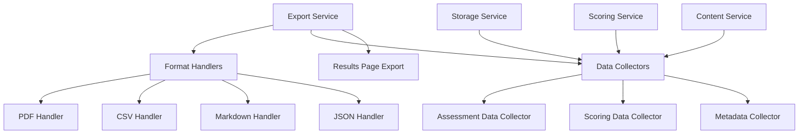

# Design Document

## Overview

The comprehensive export functionality enhancement will extend the existing PDF and CSV export capabilities in the MITA State Self-Assessment Tool to include all user inputs and generated content. The design introduces two new export formats (Markdown and JSON), enhances the existing formats with missing data, and improves the export experience on the assessment results page.

The current export functionality is limited to the AssessmentResults component and only captures partial data. This enhancement will create a centralized export service that can generate complete data exports in four formats, accessible from the enhanced results page interface.

## Architecture

### Current State Analysis

**Existing Export Implementation:**
- Located in `src/components/assessment/AssessmentResults.tsx`
- Uses jsPDF and jsPDF-AutoTable for PDF generation
- Generates CSV using string concatenation
- Only accessible from the results page
- Missing key data elements: system name, timestamps, detailed checkbox states, all text fields in CSV

**Data Sources:**
- Assessment data from `Assessment` interface in `src/types/index.ts`
- Enhanced scoring data from `ScoringService.ts`
- Capability definitions from `ContentService`

### New Architecture



### Service Layer Design

**ExportService** - Central service for all export operations
- Coordinates data collection from multiple sources
- Manages format-specific generation
- Handles file naming and download triggers
- Provides consistent error handling

**ExportDataCollector** - Aggregates all assessment data
- Collects complete assessment metadata
- Gathers enhanced scoring information
- Retrieves all user-generated text content
- Compiles checkbox states and completion data

**Format Handlers** - Specialized generators for each format
- `PDFExportHandler` - Enhanced PDF generation
- `CSVExportHandler` - Complete CSV with all fields
- `MarkdownExportHandler` - Structured Markdown output
- `JSONExportHandler` - Complete data preservation

## Components and Interfaces

### Core Interfaces

```typescript
interface ExportData {
  assessment: Assessment;
  scores: EnhancedMaturityScore[];
  metadata: ExportMetadata;
  capabilities: CapabilityDefinition[];
}

interface ExportMetadata {
  exportedAt: string;
  exportedBy?: string;
  exportVersion: string;
  systemName?: string;
  lastSavedAt?: string;
  completionPercentage: number;
}

interface ExportOptions {
  format: 'pdf' | 'csv' | 'markdown' | 'json';
  includeCharts?: boolean;
  includeDetails?: boolean;
  includeCheckboxDetails?: boolean;
  customFilename?: string;
}

interface ExportResult {
  success: boolean;
  filename: string;
  size?: number;
  error?: string;
}
```

### Service Implementation

```typescript
class ExportService {
  private dataCollector: ExportDataCollector;
  private formatHandlers: Map<string, ExportHandler>;
  
  async exportAssessment(
    assessmentId: string, 
    options: ExportOptions
  ): Promise<ExportResult>;
  
  async generateFilename(
    assessment: Assessment, 
    format: string, 
    customName?: string
  ): Promise<string>;
  
  private async collectExportData(assessmentId: string): Promise<ExportData>;
}

abstract class ExportHandler {
  abstract generate(data: ExportData, options: ExportOptions): Promise<Blob>;
  abstract getFileExtension(): string;
  abstract getMimeType(): string;
}
```

### Component Integration

**Enhanced Export UI Components:**
- `ExportDialog` - Modal for format selection and options
- `ExportButton` - Reusable export trigger component
- `ExportProgress` - Progress indicator for large exports
- `ExportHistory` - Track recent exports (future enhancement)

**Integration Points:**
- Results Page: Enhanced export section with all formats

## Data Models

### Complete Export Data Structure

The export system will capture all available data from the assessment:

**Assessment Metadata:**
```typescript
{
  id: string;
  stateName: string;
  systemName?: string; // Currently missing from exports
  createdAt: string;
  updatedAt: string;
  lastSavedAt?: string; // New field to track auto-save
  status: AssessmentStatus;
  completionPercentage: number;
  exportedAt: string; // Export timestamp
  exportVersion: string; // For future compatibility
}
```

**Enhanced Capability Data:**
```typescript
{
  capabilityId: string;
  domain: string;
  capabilityArea: string;
  status: string;
  overallScore: number;
  baseScore: number;
  partialCredit: number;
  dimensions: {
    [dimension: string]: {
      maturityLevel: number;
      finalScore: number;
      partialCredit: number;
      checkboxCompletion: {
        completed: number;
        total: number;
        percentage: number;
        individualStates: Record<string, boolean>; // New: individual checkbox states
      };
      textContent: {
        evidence: string; // Supporting Attestation
        barriers: string; // Barriers and Challenges
        plans: string; // Outcomes-Based Advancement Plans
        notes: string; // Additional Notes
      };
    };
  };
}
```

### Format-Specific Data Transformations

**Markdown Structure:**
```markdown
# MITA Assessment Export
## Assessment Information
- State: [stateName]
- System: [systemName]
- Created: [createdAt]
- Last Updated: [updatedAt]
- Status: [status]

## Domain: [domainName]
### Capability: [capabilityName]
#### Outcomes Dimension
- **Maturity Level:** 3
- **Final Score:** 3.25 (Level 3 + 0.25 bonus)
- **Checkbox Completion:** 2/8 (25%)

**Supporting Attestation:**
[evidence text]

**Barriers and Challenges:**
[barriers text]
```

**JSON Structure:**
```json
{
  "exportMetadata": {
    "exportedAt": "2025-08-06T10:30:00Z",
    "exportVersion": "1.0",
    "schemaVersion": "1.0"
  },
  "assessment": { /* complete assessment object */ },
  "enhancedScores": [ /* enhanced scoring data */ ],
  "capabilityDefinitions": [ /* capability definitions used */ ]
}
```

**Enhanced CSV Structure:**
```csv
Domain,Capability,Overall_Score,Base_Score,Partial_Credit,
Outcome_Level,Outcome_Score,Outcome_Bonus,Outcome_Checkboxes_Completed,Outcome_Checkboxes_Total,
Outcome_Evidence,Outcome_Barriers,Outcome_Plans,Outcome_Notes,
[repeated for all ORBIT dimensions]
```

## Error Handling

### Export Error Categories

1. **Data Collection Errors**
   - Missing assessment data
   - Corrupted scoring information
   - Unavailable capability definitions

2. **Format Generation Errors**
   - PDF generation failures
   - CSV encoding issues
   - Markdown formatting problems
   - JSON serialization errors

3. **Browser/System Errors**
   - File download restrictions
   - Storage quota exceeded
   - Network connectivity issues

### Error Recovery Strategies

```typescript
interface ExportErrorHandler {
  handleDataCollectionError(error: Error): Promise<Partial<ExportData>>;
  handleFormatGenerationError(error: Error, format: string): Promise<Blob | null>;
  handleDownloadError(error: Error): Promise<void>;
}
```

**Fallback Mechanisms:**
- Partial data export when some data is unavailable
- Alternative download methods (data URLs, manual save)
- Graceful degradation for unsupported browsers
- Export queue for retry functionality

## Testing Strategy

### Unit Testing

**Service Layer Tests:**
- `ExportService.test.ts` - Core export functionality
- `ExportDataCollector.test.ts` - Data aggregation logic
- Format handler tests for each export type
- Error handling and edge cases

**Component Tests:**
- Export UI component interactions
- Integration with existing assessment components
- Accessibility compliance for export dialogs

### Integration Testing

**End-to-End Export Workflows:**
- Complete export process from dashboard
- Export from assessment workflow
- Export from results page
- Multi-format export validation

**Data Integrity Tests:**
- Verify all assessment data is captured
- Validate enhanced scoring calculations
- Confirm text content preservation
- Check checkbox state accuracy

### Performance Testing

**Large Assessment Handling:**
- Export performance with multiple capabilities
- Memory usage during PDF generation
- Browser compatibility across formats
- File size optimization

### Browser Compatibility Testing

**Cross-Browser Export Support:**
- Chrome, Firefox, Safari, Edge compatibility
- Mobile browser export functionality
- Download behavior consistency
- File naming across platforms

## Implementation Phases

### Phase 1: Core Export Service (Week 1-2)
- Create ExportService and ExportDataCollector
- Implement JSON export handler (simplest format)
- Add export access to results page
- Basic error handling and testing

### Phase 2: Enhanced Formats (Week 2-3)
- Implement Markdown export handler
- Enhance existing PDF export with missing data
- Enhance existing CSV export with all fields
- Add export options dialog

### Phase 3: Results Page Integration (Week 3-4)
- Integrate enhanced export functionality into results page
- Implement export progress indicators
- Add export format selection interface
- Comprehensive testing and bug fixes

### Phase 4: Polish and Optimization (Week 4)
- Performance optimization
- Enhanced error handling
- Accessibility improvements
- Documentation and user guidance