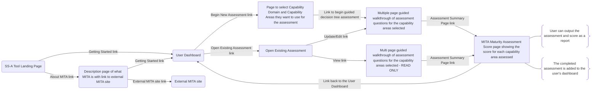

# MITA State Self-Assessment Tool - Assessment Workflow

## Overview

This document outlines the assessment workflow and user journey for the MITA State Self-Assessment (SS-A) Tool. It describes how users navigate through the assessment process, from initial setup to final reporting.

## User Journey Map



## Key User Journey Components

### Landing Page

#### User Actions
* Access the SS-A Tool through web browser
* Click "Getting Started" to proceed to dashboard
* Click "About MITA" to learn about the framework
* Navigate between information and action options

#### System Behavior
* Display welcome message and tool overview
* Present clear navigation options with descriptive labels
* Load quickly with minimal dependencies
* Provide accessible entry points for all user types

### User Dashboard

#### User Actions
* Review existing assessments and their status
* Click "Begin New Assessment" to start fresh evaluation
* Click "Open Existing Assessment" to continue or review previous work
* Navigate back to landing page if needed

#### System Behavior
* Load and display saved assessments from browser storage
* Show assessment progress indicators and completion status
* Provide quick access to both creation and management functions
* Display assessment metadata (dates, domains, completion status)

### MITA Information Page

#### User Actions
* Read about MITA framework concepts and benefits
* Click external link to visit official MITA website
* Click "Getting Started" to proceed to dashboard
* Navigate back to landing page

#### System Behavior
* Present educational content about MITA in accessible format
* Open external MITA site in new tab/window
* Maintain user's place in the application flow
* Provide clear pathways to continue assessment process

### Assessment Setup

#### User Actions
* Select capability domains relevant to their assessment
* Choose specific capability areas within selected domains
* Review selections before proceeding
* Navigate back to modify selections if needed

#### System Behavior
* Display capability domains and areas in organized structure
* Validate that at least one capability area is selected
* Save selections to browser storage
* Generate customized assessment flow based on selections

### Guided Assessment Process

#### User Actions
* Progress through multi-page assessment questions
* Select maturity levels for each ORBIT dimension
* Provide supporting evidence in text fields
* Document advancement plans
* Save progress at any point
* Navigate between assessment pages

#### System Behavior
* Present assessment questions in logical sequence
* Auto-save user inputs every 30 seconds
* Validate required fields before allowing progression
* Track completion status across all dimensions
* Provide contextual help and reference materials
* Support both forward and backward navigation

### Assessment Results

#### User Actions
* Review MITA maturity scores for assessed capability areas
* Generate and download assessment reports
* Return to dashboard to access other assessments
* Share results with stakeholders

#### System Behavior
* Calculate and display maturity scores based on user inputs
* Generate formatted PDF/CSV reports
* Update assessment status to "Completed"
* Add completed assessment to user's dashboard
* Provide visualization of results across capability areas

### Assessment Management

#### User Actions
* Choose between "Update/Edit" and "View" modes for existing assessments
* Modify assessment responses in edit mode
* Review completed assessments in read-only mode
* Delete or archive old assessments

#### System Behavior
* Load existing assessment data from browser storage
* Present appropriate interface based on selected mode (edit vs. view)
* Maintain data integrity during updates
* Track version history and modification dates
* Provide confirmation dialogs for destructive actions

## Assessment Navigation Flow

The SS-A Tool implements a guided navigation approach:

```
SS-A Tool Landing Page
 |
 |-----> About MITA -----> External MITA Resources
 |                    |
 |                    v
 |-----> Getting Started -----> User Dashboard
                                |
                                |-----> Begin New Assessment
                                |        |
                                |        v
                                |       Select Capability Domain & Areas
                                |        |
                                |        v
                                |       Guided Assessment Walkthrough
                                |        |
                                |        v
                                |       Assessment Summary & Scoring
                                |        |
                                |        v
                                |       Generate Reports & Return to Dashboard
                                |
                                |-----> Open Existing Assessment
                                         |
                                         |-----> Update/Edit -----> Guided Assessment Walkthrough
                                         |
                                         |-----> View (Read-Only) -----> Assessment Summary & Scoring
```

## Assessment Question Flow

Within the guided assessment walkthrough, each capability area follows this pattern:

1. **Capability Overview**: Introduction and context
2. **ORBIT Dimension Assessment**: Systematic evaluation across:
   - Outcome dimension
   - Role dimension 
   - Business Process dimension
   - Information dimension
   - Technology dimension
3. **Maturity Level Selection**: Choose appropriate maturity level
4. **Evidence Documentation**: Provide supporting evidence
5. **Advancement Planning**: Document improvement plans
6. **Progress Tracking**: Save and continue to next area

## Assessment States

An assessment can exist in the following states:

1. **Not Started**: Capability assessment has not been initiated
2. **In Progress**: Partially completed assessment with saved data
3. **Completed**: All dimensions assessed with maturity levels selected
4. **Reviewed**: Assessment has been marked as reviewed by user
5. **Exported**: Assessment has been exported to PDF/CSV

## Progress Tracking

The system tracks and displays assessment progress at multiple levels:

1. **Overall Assessment**: Percentage of capability areas with completed assessments
2. **Capability Domain**: Completion status for domains (e.g., Provider Management)
3. **Capability Area**: Status of individual capability assessments
4. **Dimension**: Completion status for each ORBIT dimension

## Form Structure

Each dimension assessment includes the following components:

1. **Dimension Overview**: Description of the dimension and assessment approach
2. **Reference Materials**: Context-specific guidance and documentation
3. **Assessment Questions**: Structured questions to guide maturity determination
4. **Maturity Selection**: Radio buttons or similar controls for selecting maturity level
5. **Evidence Fields**: Text areas for documenting supporting evidence
6. **Advancement Plans**: Areas to document plans for maturity improvement
7. **Notes**: General notes field for additional context or considerations

## Save and Resume Workflow

The SS-A Tool implements comprehensive data persistence:

1. **Autosave**: Assessment data saved to browser storage every 30 seconds
2. **Explicit Save**: User-triggered save action at any point
3. **Navigation Warning**: Alert when leaving unsaved changes
4. **Dashboard Integration**: Completed assessments automatically appear on user dashboard
5. **Assessment States**: Support for both editable and read-only viewing modes
6. **Resume Options**: Access existing assessments through dashboard interface
7. **Storage Management**: Options to manage saved assessments

## Browser Storage Implementation

For data persistence without a server:

1. **localStorage**: Primary storage for assessment metadata and progress tracking
2. **IndexedDB**: Storage for detailed assessment data that may exceed localStorage limits
3. **Export/Import**: JSON export/import functionality to transfer data between sessions

## Accessibility Considerations

The assessment workflow incorporates accessibility best practices:

1. **Keyboard Navigation**: Complete assessment possible using keyboard alone
2. **Screen Reader Support**: ARIA labels and proper semantic structure
3. **Focus Management**: Clear visual indicators of focused elements
4. **Error Handling**: Accessible error messages and validation
5. **Color Independence**: Information conveyed by more than just color
6. **Responsive Design**: Adaptable to different screen sizes and zoom levels

## Implementation Guidance

When implementing the assessment workflow:

1. Prioritize user experience and intuitiveness
2. Ensure browser storage operations don't block the UI thread
3. Provide clear feedback on save/load operations
4. Implement graceful error handling for storage failures
5. Design for progressive enhancement
6. Test with real users throughout development

